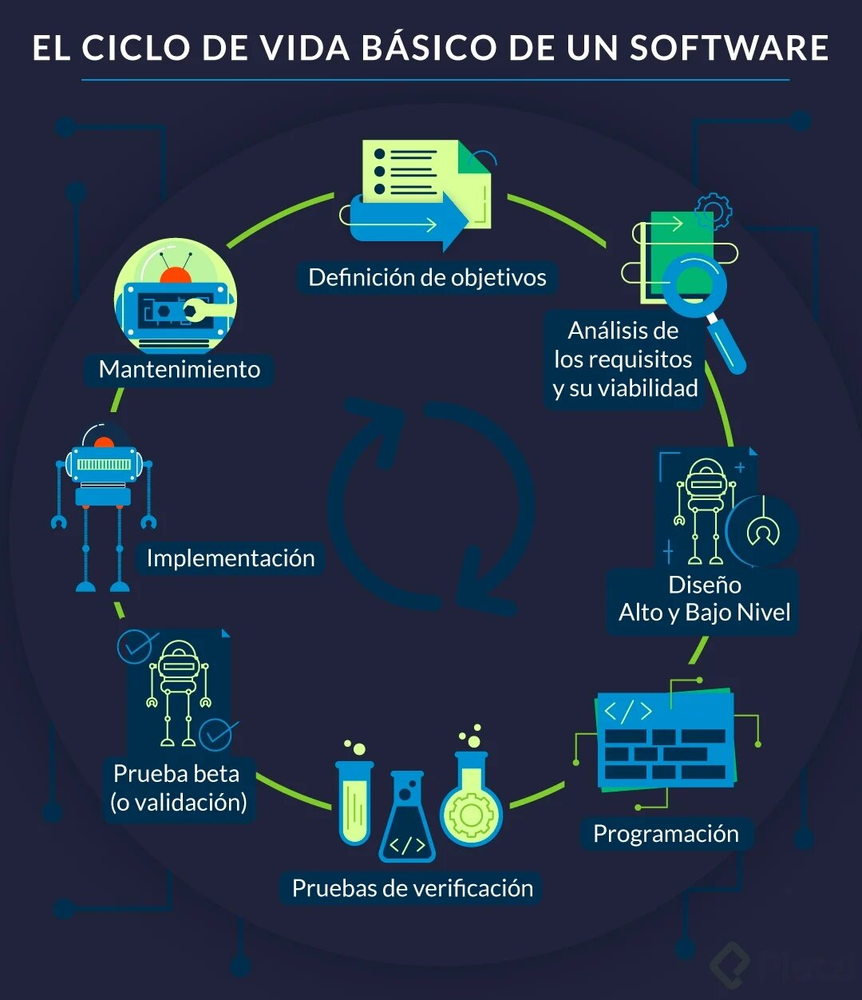
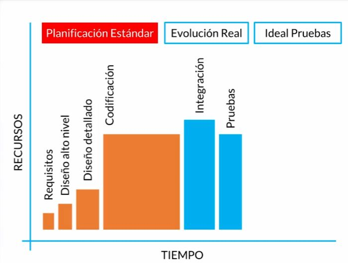
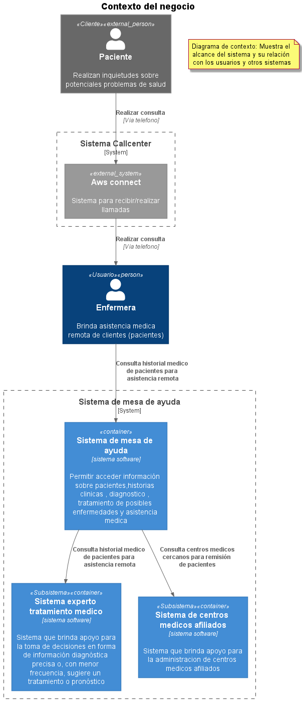
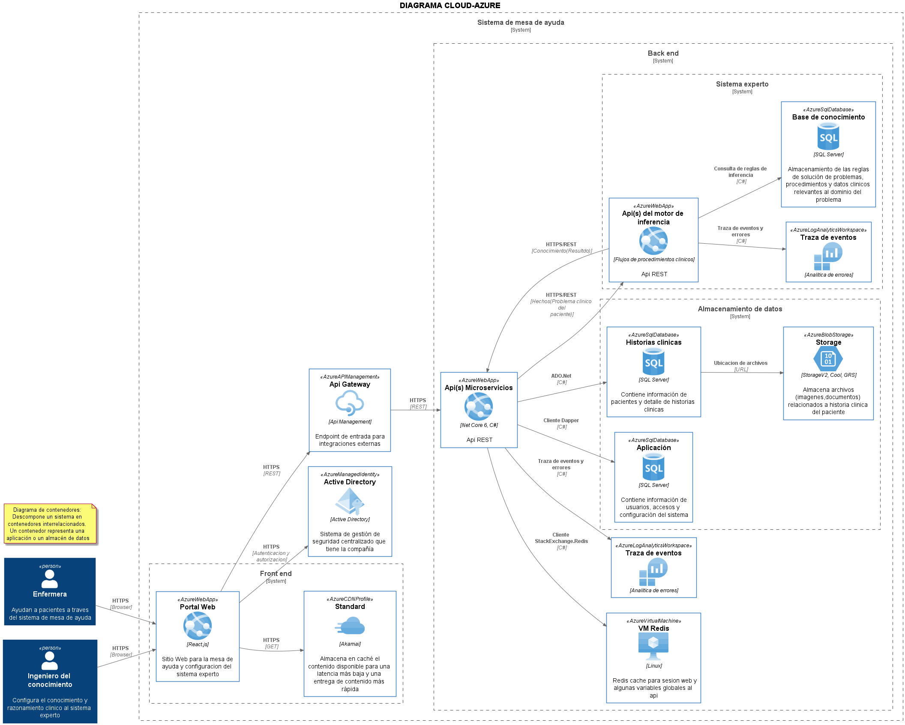
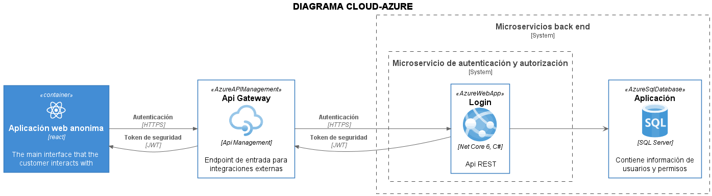
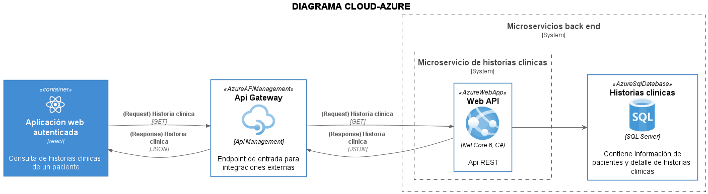
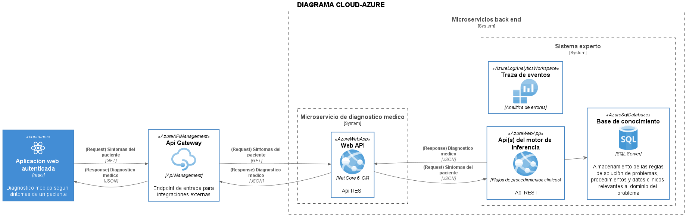
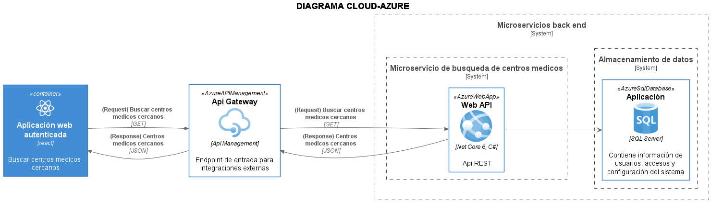
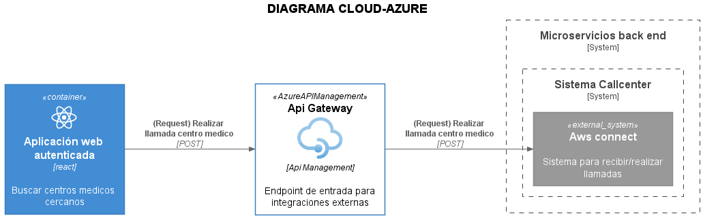
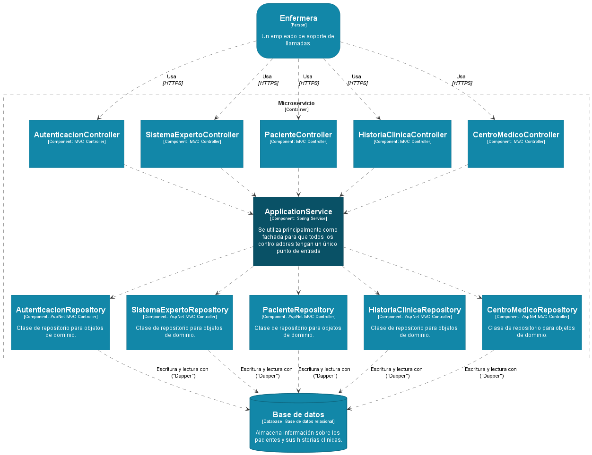

# HandsOnTest.Arquitecture

## Contexto
Una compañía desea construir una aplicación que soporte un centro de llamadas de enfermeras, respondiendo 
preguntas de clientes (pacientes) acerca de potenciales problema de salud. El número de enfermeras proyectados 
en el centro de llamadas es de 250 o más. En una fase posterior se debe habilitar un canal para el uso directo de 
los clientes de la aplicación.
La autenticación y autorización de las enfermeras se debe realizar contra un sistema de gestión de seguridad 
centralizado que tiene la compañía.
La compañía requiere que la aplicación sea soportada para sistemas operativos Windows, Linux y MAC y que la 
mayoría de los componentes sean alojados en la nube, además de ser segura y disponible.
Las siguientes son las funcionalidades a implementar en la aplicación.

## Historias de usuario
|ID|Descripción
|---|---|
|01|COMO enfermera QUIERO acceder a la historia clínica de un paciente PARA conocer su historial médico.|
|02|COMO enfermera QUIERO que la aplicación me asista en el diagnóstico médico según los síntomas PARA una atención más oportuna de los pacientes.|
|03|COMO enfermera QUIERO conocer los centros médicos más cercanos a la ubicación del paciente PARA remitir al paciente al centro médico, en caso de requerirlo|
|04|COMO enfermera QUIERO contactar al centro médico PARA informar de la llegada del paciente y poder brindarle una atención oportuna.|

## Etapas de la aplicación

1. **Definición de objetivos**
En esta fase se define el alcance general del software y su papel dentro de una estrategia global o dentro del ecosistema que va a funcionar.
2. **Análisis de los requisitos y su viabilidad**
Se trata de recopilar la mayor cantidad de información posible para evaluar la viabilidad del producto, encontrar posibles restricciones y analizar todos los requisitos del cliente.
3. **Diseño**
    * *Alto nivel*: Se trata de realizar un diseño básico que valide la arquitectura de la aplicación.
    * *Bajo nivel*: Es una definición detallada de la estructura de la aplicación basada en el diseño general.
4. **Programación**
Es la implementación de un lenguaje de programación o varios para crear las funciones definidas durante la etapa de diseño.
5. **Pruebas de verificación**
Aunque en todas las fases anteriores se hacen pruebas, en esta fase se cubren: Pruebas de componentes, integrales y de sistema.
6. **Prueba beta (o validación)** 
Se hace para garantizar que el software cumple con las especificaciones originales o también se hacen las pruebas de aceptación.
7. **Implementación**
Se realiza una prueba del sistema implementado para encontrar posibles fallas en la implementación.
8. **Mantenimiento**
Se hace para todos los procedimientos correctivos (mantenimiento correctivo) y a las actualizaciones secundarias del software (mantenimiento continuo), junto con la actualización de las pruebas.

## Planificación estandar de la aplicación por etapas

## Modelado C4 de la arquitectura
El modelado C4 define la arquitectura de software en diferentes niveles de detalle. Un modelo C4 es un conjunto de diagramas que representan el contexto, los contenedores, los componentes y el código de una pieza de software.

Para la elaboración de los diagramas UML se utilizó la herramienta [PlantUML](https://plantuml.com/es/) de codigo abierto. Los diagramas son definidos usando un lenguaje programable sencillo e intuitivo. [Guía de Referencia del Lenguaje PlantUML](https://plantuml.com/es/guide).

### Nivel 1: Diagramas de contexto
Los diagramas de contexto son la descripción más general de lo que hace su sistema, quién lo usará y con qué otros sistemas interactuará. Un diagrama de contexto ayuda a describir el alcance e identificar usuarios y qué problema se va a resolver.

[Codigo fuente plantUml](diagrama-1-contexto.puml)

### Nivel 2: Diagramas de contenedores
El diagrama de contenedor describe el sistema de software y muestra las API, las aplicaciones, las bases de datos y los microservicios que utilizará el sistema. Cada una de estas aplicaciones o servicios se representa con un contenedor y las interacciones entre ellos se muestran en un alto nivel.

[Codigo fuente plantUml](diagrama-2-contenedor.puml)

### Nivel 3: Diagramas de componentes
Un paso más profundo que el diagrama de contenedores, el diagrama de componentes detalla grupos de código dentro de un solo contenedor. Estos componentes representan abstracciones del código.

### Autenticación y autorización

[Codigo fuente plantUml](diagrama-3-componentes-autenticacion.puml)

### Historia 1 Acceso historia clinica

[Codigo fuente plantUml](diagrama-3-componentes-historia01.puml)

### Historia 2 Asistencia medica

[Codigo fuente plantUml](diagrama-3-componentes-historia02.puml)

### Historia 3 Centros medicos

[Codigo fuente plantUml](diagrama-3-componentes-historia03.puml)

### Historia 4 Contactar centro medico

[Codigo fuente plantUml](diagrama-3-componentes-historia04.puml)

### Nivel 4: Representación de código
El último nivel requiere muchos detalles para mostrar cómo se implementa realmente el código de un solo componente. Para hacer esto, es necesario un diagrama de clase UML, un diagrama de relación de entidad o de componentes que describa la interacción del sistema.

[Codigo fuente plantUml](diagrama-4-codigo-domaindrivendesign.puml)

# Prerequisitos
- [.NET SDK](https://dotnet.microsoft.com/download/dotnet/6.0): 6.0.100-preview.5.21271.2
- Herramientas de desarrollo:
  - [vscode IDE](https://code.visualstudio.com/) IDE
  - [Postman](https://www.postman.com/) plataforma API para analizar y usar API
  - [PlantUML](https://plantuml.com/es/) diagramas uml

# Stack de tecnologia
- ✔️ **[`.NET Core 6`](https://dotnet.microsoft.com/download)** - .NET Framework y .NET Core, incluyendo ASP.NET and ASP.NET Core
- ✔️ **[`MVC Versioning API`](https://github.com/microsoft/aspnet-api-versioning)** - Conjunto de bibliotecas que agregan versiones de API de servicio a ASP.NET Web API, OData con ASP.NET Web API y ASP.NET
- ✔️ **[`Dapper`](https://github.com/DapperLib/Dapper)** - Un mapeador de objetos ORM simple para .Net
- ✔️ **[`FluentValidation`](https://github.com/FluentValidation/FluentValidation)** - Popular biblioteca de validación de .NET para crear reglas de validación fuertemente tipadas
- ✔️ **[`Swagger & Swagger UI`](https://github.com/domaindrivendev/Swashbuckle.AspNetCore)** - Herramientas Swagger para documentar las API integradas en ASP.NET Core
- ✔️ **[`serilog`](https://github.com/serilog/serilog)** - Simple .NET logging
- ✔️ **[`Polly`](https://github.com/App-vNext/Polly)** - Polly es una biblioteca de manejo de fallas transitorias y resiliencia de .NET que permite a los desarrolladores expresar políticas como Reintentar,  Tiempo de espera  y Fallback de manera fluida y segura para subprocesos
- ✔️ **[`opentelemetry-dotnet`](https://github.com/open-telemetry/opentelemetry-dotnet)** - Cliente .NET Client para la telemetria

